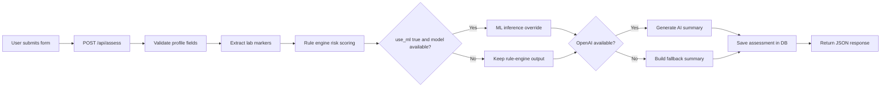

# Architecture

## High-Level Layers

1. Presentation Layer
- Public website pages
- User portal pages
- Admin portal pages
- JS client calls to `/api/*`

2. Application Layer
- Flask blueprints in `backend/routes/`
  - `public_routes.py`
  - `auth_routes.py`
  - `admin_routes.py`
  - `api_routes.py`

3. Domain/Service Layer
- `risk_engine.py` for correlation logic
- `model_inference.py` for ML artifact prediction
- `openai_service.py` for AI summary/chat
- `summary_service.py` fallback summary

4. Data Layer
- `backend/models/db.py` (SQLite/Postgres connection + init)
- `user_model.py`, `assessment_model.py`, `admin_model.py`

## Request Flow (Assessment)

## Session/Auth Flow

- User auth:
  - `/signup` creates account in `users`
  - `/login` validates and sets `session[user_id]`
  - `/dashboard/*` requires user session

- Admin auth:
  - `/admin/login` validates against `admin_users`
  - sets `session[is_admin]`
  - `/admin/*` and `/api/admin/assessments` require admin session

## Data Persistence Strategy

- Local default: SQLite at `backend/data/app.db`
- Production: set `DATABASE_URL` for PostgreSQL
- Tables auto-created at startup by `init_db()`

## ML and AI Integration

- ML artifacts loaded from `ml/artifacts/`
- Prediction source is tracked in assessment JSON (`rule_engine` or `ml_model`)
- AI summary/chat enabled when `OPENAI_API_KEY` is present
- On AI failure, fallback summary/chat logic is used

## Deployment Notes

- Render is best for monolithic Flask deployment.
- Vercel serverless requires external Postgres for persistence.
